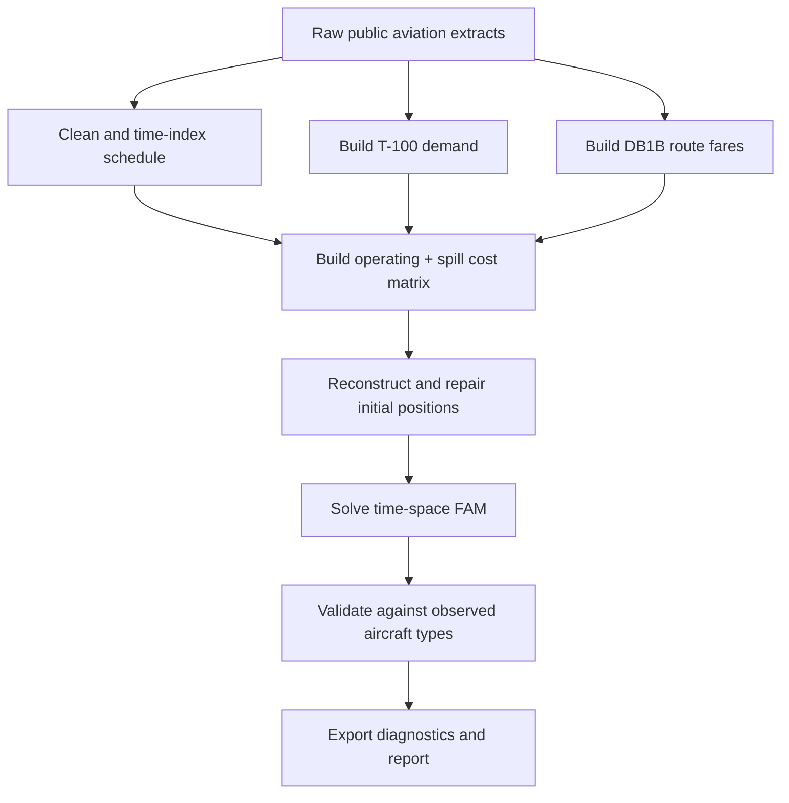

# FAM recreation workflow

The optimization layer uses three aircraft types — ERJ145, ERJ170 and ERJ175 — and a compressed airport/time network containing active event nodes. This keeps the flow-balance formulation faithful to the paper while avoiding inventory variables for every possible airport/time combination.
